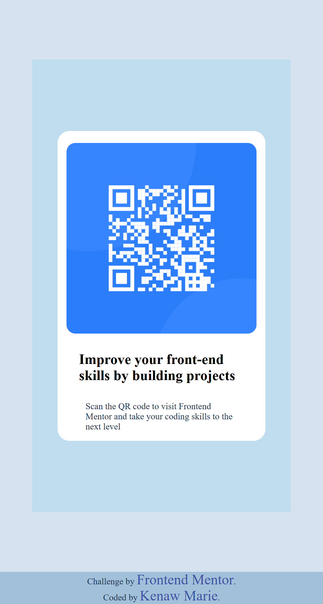

# Frontend Mentor - QR code component solution

## Table of contents

  - [Overview](#overview)
  - [Screenshot](#screenshot)
  - [Links](#links)
  - [Built with](#built-with)
  - [What I learned](#what-i-learned)
  - [Continued development](#continued-development)
  - [Author](#author)
  - [Acknowledgments](#acknowledgments)

## Overview

This is a solution to the [QR code component challenge on Frontend Mentor](https://www.frontendmentor.io/challenges/qr-code-component-iux_sIO_H). Frontend Mentor challenges help you improve your coding skills by building realistic projects.

### Screenshot

### Links

- Live Site URL: [QR code component](https://kenawmarie.github.io/front-qr-code-component-main/)

### Built with

- Semantic HTML5 markup
- CSS custom properties
- Flexbox

### What I learned

In this project i learnt how to layout a page using flexbox, margin,padding, typography and other css properties.

### Continued development

i want to focus on using flexbox and css grid to layout a page.

## Author
- Kenaw Marie
- Frontend Mentor - [@KenawMarie](https://www.frontendmentor.io/profile/KenawMarie)

## Acknowledgments

my special thanks goes to first to [Free Code Camp](https://www.freecodecamp.org/) then [The Odin Project](https://www.theodinproject.com/) finally to [Frontend mentor](https://www.frontendmentor.io/) for this challenge.

